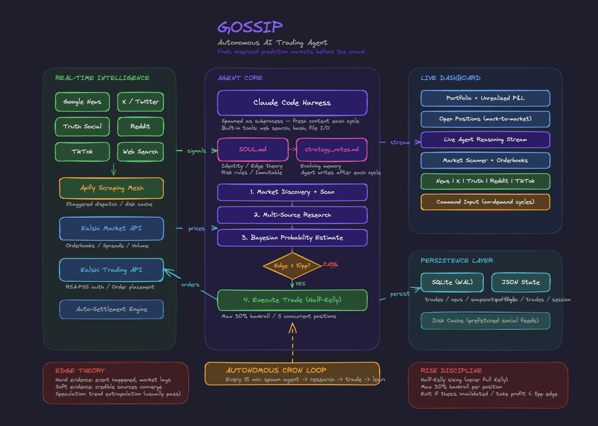

# Gossip Trading

**You've seen the posts. Someone on X made $1M on Polymarket betting on the election. Another turned $50K into $500K calling the Fed rate decision. We built the agent that does it for you while you sleep.**

Gossip Trading is a fully autonomous AI agent that scrapes news, reasons about real-world events, and executes real trades on prediction markets — no human in the loop.

On a configurable interval, Claude Code is spawned as a subprocess with access to the internet, market data, and a trading account. Its job: figure out what's happening in the world, find where markets are wrong, and trade.



---

## How It Works

1. **Scrape** — Pulls real-time signals from Reddit, Twitter/X, TikTok, Truth Social, and Google News via Apify
2. **Reason** — Claude reads primary sources, cross-references headlines, and estimates true probabilities
3. **Trade** — When it finds edge, it sizes positions using Kelly criterion and executes real trades on Kalshi
4. **Learn** — Writes strategy notes for its future self, building memory across cycles

No rules engine. No hardcoded strategies. Pure reasoning — the same kind those Twitter traders use, just faster and tireless.

```
"Bondi was fired April 2. Market still at 82¢ YES for 'leaves before Apr 5.'
 That's near-arbitrage. Buying 10 contracts." — Gossip Trading, Cycle 1
```

---

## Where the Edge Comes From

The agent is a news agent at its core. It operationalizes information that retail traders skim. It focuses where the edge is richest: legislative markets (retail doesn't read bill text), confusion premiums (headlines create more uncertainty than the details warrant), and resolution lag (events happen before markets update). During our demo, it spotted a market still open on Pam Bondi's AG departure — days after Trump already fired her — and traded on it live.

### Thesis Mode

Have a lead? Type a hypothesis — *"I think tariffs will escalate"* — and the agent researches it, finds relevant markets, and trades on your behalf.

---

## Architecture: The Paperclip Pattern

The core insight: **Claude Code IS the agent.** We don't call the Anthropic API. We spawn the `claude` CLI as a subprocess, which gives us a full reasoning agent with built-in tool use — web search, file I/O, bash execution — at zero marginal LLM cost on a Max subscription.

```
                           ┌──────────────────────────────────┐
                           │         ORCHESTRATOR             │
                           │           main.py                │
                           │                                  │
                           │  Spawns Claude Code subprocess   │
                           │  Pipes prompt → streams output   │
                           │  Manages cycle lifecycle         │
                           └────────────┬─────────────────────┘
                                        │
                                   stdin/stdout
                                  (stream-json)
                                        │
┌───────────────────────────────────────▼───────────────────────────────────────┐
│                                                                              │
│                        CLAUDE CODE  (the reasoning engine)                   │
│                                                                              │
│   Reads SOUL.md for identity, risk rules, and strategy principles            │
│   Reads strategy_notes.md for accumulated experience across sessions         │
│   Decides what to research, what to trade, when to exit                      │
│                                                                              │
│   ┌─────────┐  ┌──────────┐  ┌──────────┐  ┌──────────┐  ┌──────────────┐   │
│   │WebSearch│  │ WebFetch │  │   Bash   │  │  Read/   │  │    Write     │   │
│   │(native) │  │ (native) │  │ (native) │  │  Glob    │  │   (native)   │   │
│   └────┬────┘  └────┬─────┘  └────┬─────┘  └────┬─────┘  └──────┬───────┘   │
│        │            │             │              │               │           │
│        │    Searches Google,      │     Reads    │      Writes   │           │
│        │    reads articles,       │    SOUL.md,  │   strategy    │           │
│        │    follows links         │    notes,    │    notes,     │           │
│        │                          │    data      │   rationale   │           │
│        │                          │              │   responses   │           │
│        │            ┌─────────────▼──────────────┤               │           │
│        │            │     Python CLI Tools        │               │           │
│        │            │  (invoked via Bash tool)    │               │           │
│        │            │                             │               │           │
│        │            │  gossip/kalshi.py            │               │           │
│        │            │    → scan, search, market    │               │           │
│        │            │    → orderbook, order        │               │           │
│        │            │    → positions, balance      │               │           │
│        │            │                             │               │           │
│        │            │  gossip/trader.py            │               │           │
│        │            │    → trade, exit, settle     │               │           │
│        │            │    → portfolio, prices       │               │           │
│        │            │    → Kelly sizing, risk      │               │           │
│        │            │                             │               │           │
│        │            │  gossip/news.py              │               │           │
│        │            │    → Google News, Twitter    │               │           │
│        │            │    → article extraction      │               │           │
│        │            └──────────────┬──────────────┘               │           │
│        │                           │                              │           │
└────────┼───────────────────────────┼──────────────────────────────┼───────────┘
         │                           │                              │
         │              ┌────────────▼────────────┐                 │
         │              │       DATA LAYER        │                 │
         │              │                         │                 │
         │              │  SQLite (WAL mode)      │                 │
         │              │  trades.json            │                 │
         │              │  strategy_notes.md      │◄────────────────┘
         │              │  user_rationales.json   │
         │              └────────────┬────────────┘
         │                           │
         │              ┌────────────▼────────────┐
         │              │    NEXT.JS DASHBOARD    │
         │              │                         │
         │              │  Live agent stream      │
         │              │  Portfolio + P&L        │
         │              │  Position management    │
         │              │  Market scanner         │
         │              │  News feed              │
         │              │  Thesis submission      │
         │              └─────────────────────────┘
```

### The Agentic Loop

Each cycle, the agent:

1. **Reads its soul** — `SOUL.md` defines identity, risk discipline, and thinking framework
2. **Recalls past experience** — `strategy_notes.md` contains lessons from every previous cycle
3. **Auto-settles resolved markets** — checks Kalshi for markets that have resolved, returns capital
4. **Reviews open positions** — fetches live prices, calculates unrealized P&L, re-evaluates theses
5. **Discovers opportunities** — scans Kalshi events, searches for specific topics it knows have edge
6. **Researches deeply** — web search, news scraping, primary source analysis
7. **Estimates probability** — Bayesian reasoning: base rate → evidence → posterior
8. **Sizes and executes** — Half-Kelly position sizing with hard risk limits
9. **Writes memory** — records what it learned for the next cycle

---

## Risk Engine

The agent operates within hard guardrails it cannot override:

| Rule | Value | Why |
|------|-------|-----|
| Max position size | 30% of bankroll | No single bet can blow up the account |
| Max concurrent positions | 5 | Diversification, capital allocation |
| Minimum edge to enter | 10 percentage points | Only trade clear mispricings |
| Position sizing | Half-Kelly | Kelly criterion with 50% haircut for estimation error |
| Exit trigger | Thesis invalidated | Don't hold losers out of stubbornness |
| Profit-taking | Edge < 5pp | Lock in gains when the market catches up |

---

## Dashboard

Real-time Next.js dashboard with:

- **Live agent stream** — watch the agent think, search, and trade in real-time
- **Portfolio metrics** — bankroll, P&L, win rate, trade count
- **Position management** — expandable reasoning, live prices, Kalshi links
- **Market scanner** — sortable table of active Kalshi markets
- **Multi-source news feed** — Twitter/X, Truth Social, Reddit, TikTok, Google News
- **Thesis input** — submit a trading thesis for the agent to research
- **Agent control** — run cycles, start loops, configure interval

---

## Quick Start

```bash
# Install
pip install -r requirements.txt
cd web && npm install && cd ..

# Configure
cp .env.example .env
# Set: KALSHI_API_KEY_ID, KALSHI_PRIVATE_KEY_PATH, APIFY_API_TOKEN

# Run one cycle
python3 main.py

# Run continuous loop
python3 main.py --loop --interval 900

# Submit a thesis
python3 main.py --rationale "Tariffs on China will escalate next week"

# Dashboard
cd web && npm run dev
# → http://localhost:3000
```

## Built With

- **Claude Code** as the autonomous brain (subprocess orchestration via `--print`)
- **Apify** for real-time news and social media scraping
- **Kalshi API** for live market data and order execution
- **Next.js dashboard** with live agent streaming, portfolio tracking, and multi-source news feeds
- **SQLite** for all state — trades, news, market snapshots, agent logs
